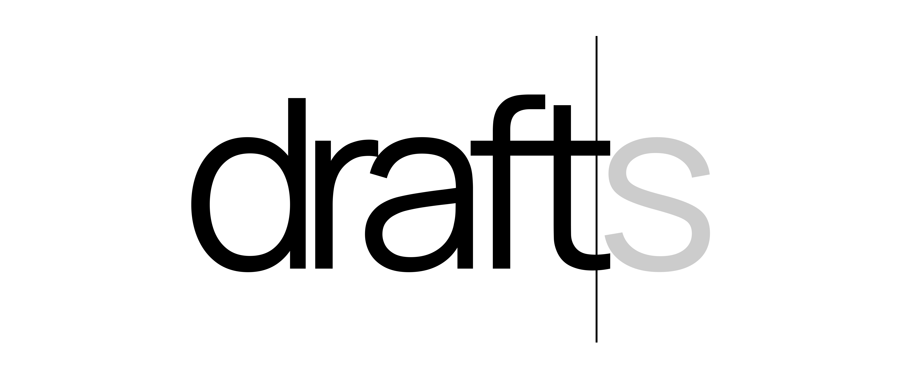

# drafts

<div align="center">
  
</div>

A minimalist text editor built with Next.js and TipTap. Features include:
- Clean, distraction-free writing environment
- Real-time autosave
- PDF export capability
- Document management system
- Beautiful typography with Manrope font

## Getting Started

First, run the development server:

```bash
npm run dev
# or
yarn dev
# or
pnpm dev
```

Open [http://localhost:3000](http://localhost:3000) with your browser to see the result.

## Technologies Used

- [Next.js](https://nextjs.org) - React framework
- [TipTap](https://tiptap.dev) - Headless rich text editor
- [Tailwind CSS](https://tailwindcss.com) - Styling
- [html2pdf.js](https://ekoopmans.github.io/html2pdf.js) - PDF export

## Deploy on Vercel

The easiest way to deploy your Next.js app is to use the [Vercel Platform](https://vercel.com/new) from the creators of Next.js.

Check out the [Next.js deployment documentation](https://nextjs.org/docs/app/building-your-application/deploying) for more details.
